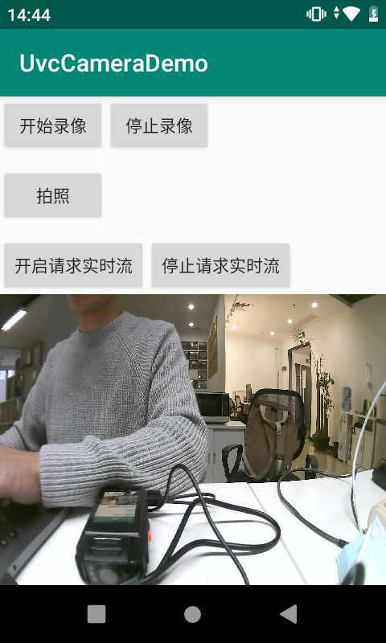

UvcCameraDemo
===================================
 
Introduction
------------
* Android App,Android Studio工程;
* 基于开源的uvc so库(https://github.com/saki4510t/UVCCamera),具有拍照、录像、获取实时流的基本功能;

Screenshots
-------------

 

License
-------
**本人从事Android Camera相关开发已有5年
**目前在深圳上班

**欢迎关注我的微信公众号“小驰笔记”~

